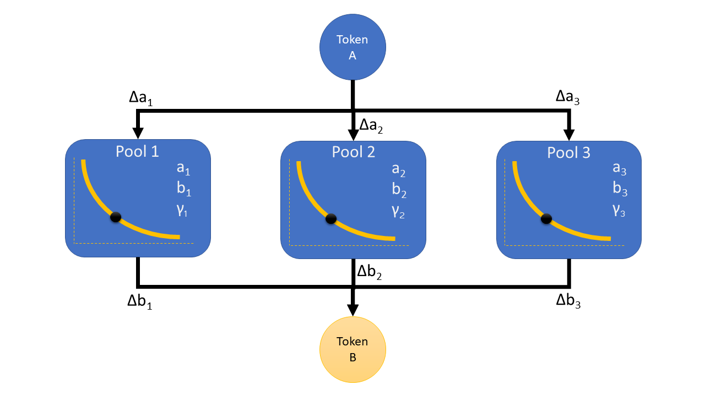
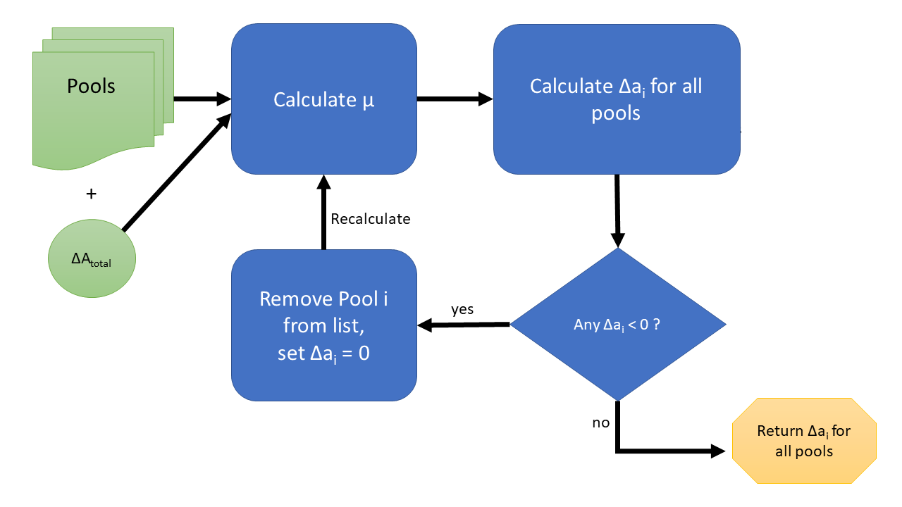
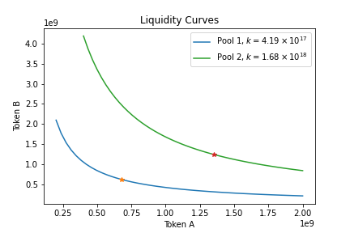
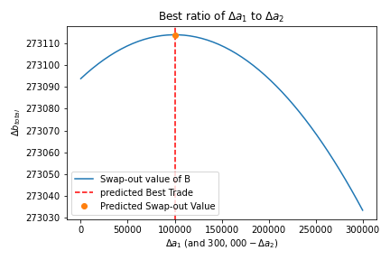

# Abstract

We have developed an algorithm to optimize a parallel swap of two tokens.
The algorithm is ideal for the Ref-Finance paradigm, with multiple liquidity pools per token pair in the same contract.
For a given swap-in amount of Token A, the algorithm maximizes the swap-out value of Token B, taking into account the liquidity and swap fees of the various A-B liquidity pools.
The solution is elegant, mathematically verifiable (using calculus and algebra), simple to implement, avoids "brute force" operations, and only requires a single call to the NEAR API to retrieve all the liquidity pools for minimal complicity or intent broadcasting.

# Overview Video

For a quick overview of the project, check out our [Youtube Video](https://youtu.be/TztFcrYLnac).

# Detailed Description

For more details on the mathematical derivation of our closed-form solution to the optimal parallel swap, please peruse our [white paper](./ParallelSwapWhitePaper.pdf).

# The Problem Statement

# Algorithm Overview

Here, we offer a flow chart summary of the algorithm implementation process. For a given set of pools and desired amount of input Token-A to trade in, you first calculate $\mu$. 
Next, you can use $\mu$ to calculate the allocation of Token-A per pool, $\Delta a_i$. 
Next, check if any of the values of $\Delta a_i <0$. If one exists, say, pool $j$, set the allocation to that pool, $\Delta a_j$, equal to zero, and remove that pool from the list of pools. Then, recalculate $\mu$ for the remaining pools. This will lead to a final output of the optimal values of allocations of Token-A, $\Delta a_i$, for each pool. 

# Assumptions

### Given Assumptions

1. There are several pools for (Token-A, Token-B) pair with different liquidities and fees.
2. A user wants to swap A for B several times with different amounts. The task is to find the best combination for each swap.

### Additional Assumptions

3. Currently, the algorithm assumes the pools follow the constant product ($x \times y = k$) model.
4. It is generally assumed that the multiple pools demonstrate (approximately) the same price of B/A. However, this assumption is not strictly necessary for our algorithm to work.
    * If multiple pools are found at different prices, it is assumed that trading and arbitrage opportunities would be undertaken to reach equilibrium before using this algorithm.
    * If the price difference is large, the simple solution would be to trade at the best price, rather than splitting the swap. The parallel swap would make sense with pools of the same price or at least close to the same price. Again, having comparable prices is *not* a requirement for our algorithm to work.
5. For each pool, the swap-in amount of Token A cannot be negative.
    * The math assumes a fee based on $\Delta A_i$ which would assume you gain fees by taking out Token A. Forcing $\Delta A_i$ to be non-negative prevents having to account for the fees in a more complicated way.
    * For pools with the same price of B/A, a negative $\Delta A_i$ is not expected. This would only be expected to happen due to price differences.
    * If the algorithm would prescribe a negative value for $\Delta A_i$, then pool $i$ is removed from consideration. (This would be the case for a worst-price pool.) Note, the process of removing a pool follows directly from the implementation of our Lagrange Multiplier solution in the presence of inequality constraints. In this case, the inequality constraint is that the allocation of Token-A for each pool must be non-negative.

### Some simulation results

Below, we show an example set of bonding curves for two pools with equal price, but different liquidities.

In the next figure, we show the calculated and expected optimal solution.

### Getting Started 🚀

Make sure you have node.js installed on your computer.

After cloning the repo, open a command prompt in the main repo folder and type:

> npm run dev

It should load a local dev server to run a basic version of the app.

### Acknowledgements

I made use of the excellent template from the following source as the first iteration of this front end:

- [https://github.com/TrevorJTClarke/near-vue-tailwind](https://github.com/TrevorJTClarke/near-vue-tailwind)

### Donate

Like this repo and material? Consider donating Eth!

0x2263B05F52e30b84416EF4C6a060E966645Cc66e
